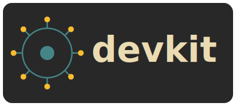
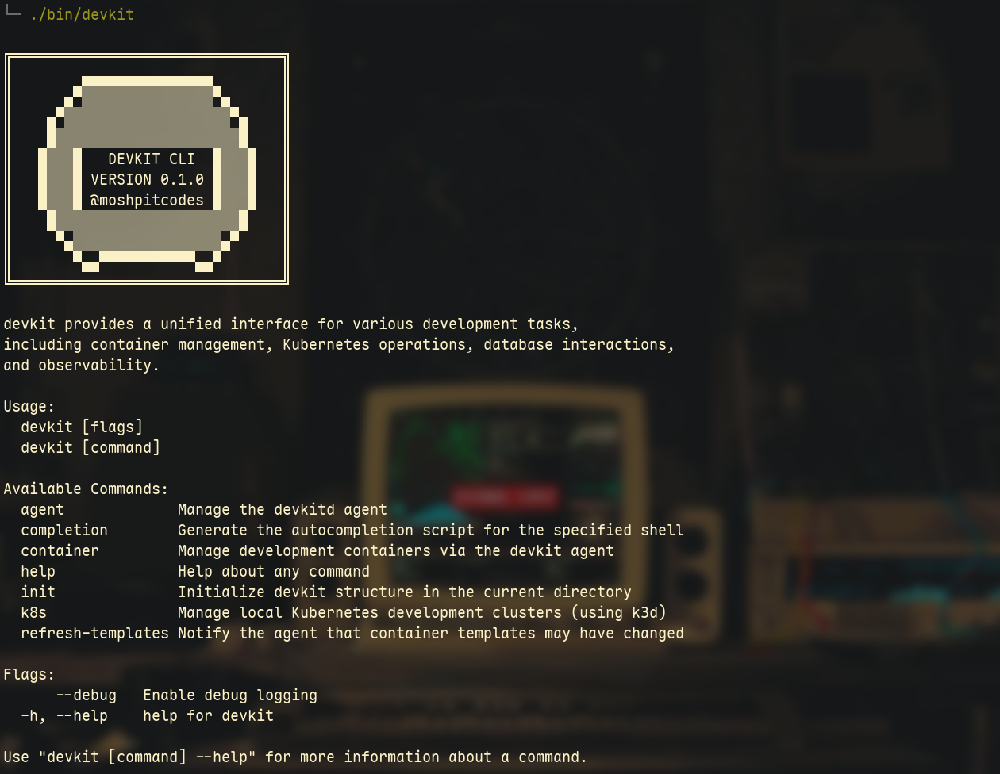
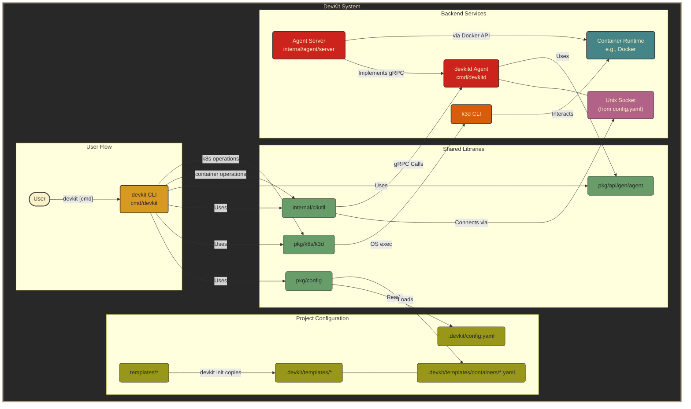
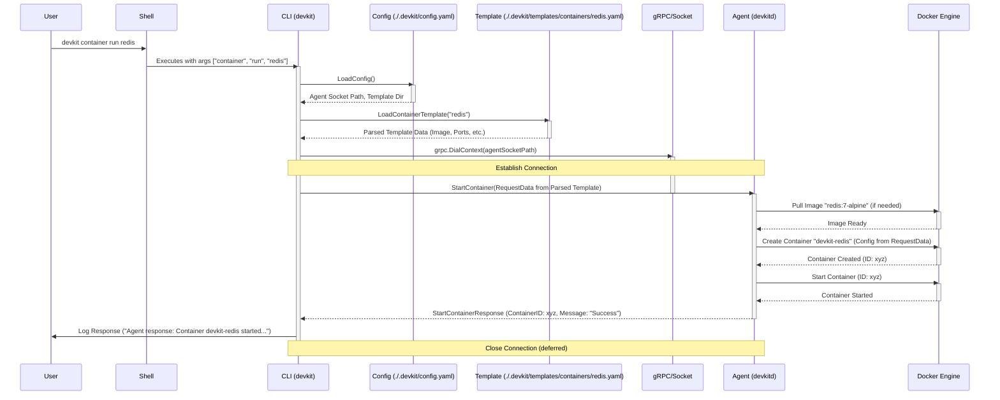

<h1 align="center">
    <!-- Placeholder logo -->
   <br>
      A Comprehensive Developer Toolkit
   <br>
      <!-- Placeholder Pallet -->
      <!--  <br> -->

   <div align="center">
      <p></p>
      <div align="center">
         <!-- Placeholder Badges - Update URLs/User/Repo as needed -->
         <a href="https://github.com/moshpitcodes/devkit/stargazers"> <!-- Adjust URL -->
            
         </a>
         <a href="https://github.com/moshpitcodes/devkit/"> <!-- Adjust URL -->
            
         </a>
         <a href="https://go.dev/">
             
         </a>
         <a href="https://github.com/moshpitcodes/devkit/blob/main/LICENSE"> <!-- Adjust URL -->
            
         </a>
      </div>
      <br>
   </div>
</h1>

<br/>

# 📦 Overview

`devkit` aims to be a comprehensive, integrated developer toolkit designed to simplify and unify common development workflows. It provides a consistent command-line interface (`devkit`) that interacts with a background agent (`devkitd`) to manage various development tasks.

Currently, `devkit` focuses on:

1.  **Templated Container Management:** Easily define, run, list, stop, remove, and view logs for development services (like databases, caches, etc.) using simple YAML templates and the underlying Docker engine.
2.  **Local Kubernetes Cluster Management:** Create, delete, list, and manage local Kubernetes development clusters using `k3d` integration.

The long-term vision is to expand `devkit` into a unified control plane for databases, observability, CI/CD, and more, reducing toolchain complexity for developers.

> [!WARNING]
> This is a project I built for myself to make these tasks not as tedious on my local development environment. I also use this as a playground to learn new things about Go, APIs, general backend and a lot more. Therefore, consider this a heavy WIP code base that might not even work on your machine. This was not the intention for the initial release. I will likely work on this more in the future, but for the time being I am happy with what I have.

<h1>
    <div align="center">
         <!-- Placeholder logo -->
        <br>
    </div>
</h1>

<br/>

## 🗃️ Project Structure

```
 .
├──  certs
├──  cmd
│   ├──  devkit
│   └──  devkitd
├──  internal
│   ├──  agent
│   ├──  cliutil
│   ├──  config
│   └──  logging
├──  pkg
│   ├──  api
│   ├──  cli
│   ├──  config
│   ├──  k8s
│   └──  tui
├──  templates
│   ├──  cicd
│   ├──  containers
│   ├──  db
│   ├──  k8s
│   └──  observe
├──  go.mod
├──  go.sum
├──  LICENSE
├──  Makefile
└── 󰂺 README.md
```

<br/>

## 📓 Project Components

| Component                                          | Responsibility                                                                                                                                                                                     |
| :------------------------------------------------- | :------------------------------------------------------------------------------------------------------------------------------------------------------------------------------------------------- |
| **`devkit` (CLI)**                                 | User-facing command-line interface. Parses commands, interacts with the agent via gRPC, displays output.                                                                                           |
| **`devkitd` (Agent)**                              | Background daemon process. Manages the lifecycle of resources (currently Docker containers via Docker SDK). Listens for gRPC requests from the CLI. Ensures singleton instance via socket binding. |
| **gRPC API** (`pkg/api`)                           | Defines the communication protocol between the CLI and the Agent using Protocol Buffers.                                                                                                           |
| **Configuration** (`pkg/config`)                   | Loads configuration from `.devkit/config.yaml`, environment variables. Provides default settings.                                                                                                  |
| **Templates** (`templates/`, `.devkit/templates/`) | YAML files defining services (currently containers). `devkit init` copies base templates to `.devkit/templates`.                                                                                   |
| **Container Runtime**                              | Relies on a running Docker engine to manage container lifecycles (pull, create, start, stop, remove, logs).                                                                                        |
| **k3d Integration** (`pkg/k8s/k3d`)                | Wraps `k3d` CLI commands to manage local Kubernetes clusters.                                                                                                                                      |
| **Logging** (`internal/logging`)                   | Centralized logging setup using `zap` for consistent, structured, and icon-enhanced console output.                                                                                                |

<br/>

# 📐 Architecture

`devkit` follows a **Client-Agent** architecture:

1.  **Client (`devkit`):** The CLI tool is the primary user interface. It parses user commands and arguments.
2.  **gRPC Communication:** For most operations (like managing containers or interacting with the agent state), the CLI connects to the Agent (`devkitd`) via a Unix Domain Socket (`/tmp/devkitd.sock` by default, configurable) using gRPC.
3.  **Agent (`devkitd`):** This long-running background process listens for gRPC requests.
    *   It maintains a connection to the Docker daemon via the Docker Go SDK.
    *   It executes actions based on gRPC requests (e.g., start a container described in a request derived from a template).
    *   It handles resource lifecycles (starting, stopping containers).
    *   It ensures only one instance runs by attempting to bind exclusively to the Unix socket.
4.  **Docker Engine:** The Agent interacts with the host's Docker engine to perform all container-related operations.
5.  **k3d CLI:** The `devkit k8s` commands directly execute `k3d` (and potentially `kubectl`) commands found in the system's PATH. This part does *not* go through the `devkitd` agent.
6.  **Configuration & Templates:** Both the CLI (for loading templates before sending requests) and the Agent (potentially for its own config) load settings from `.devkit/config.yaml` and environment variables. Container templates are loaded by the CLI from `.devkit/templates/containers/*.yaml`.




<br/>

# 🚀 Getting Started & Usage

> [!CAUTION]
> `devkit` interacts with Docker and potentially Kubernetes. Ensure you understand the commands being run, especially when using `--force` flags, as they can modify or delete containers and potentially other system resources.

> [!WARNING]
> Review the default configuration (`.devkit/config.yaml` after `init`) and templates (`.devkit/templates/`) before running containers to ensure settings (ports, volumes, environment variables) match your requirements.

<br/>

## 1. Prerequisites

*   **Go:** Version 1.24 or later required for building.
*   **Make:** For using the build commands in the `Makefile`.
*   **Docker:** A running Docker engine is required for container operations.
*   **k3d:** Required *only* if using the `devkit k8s` commands. Install from [k3d.io](https://k3d.io/).
*   **kubectl:** Required *only* if using `devkit k8s config cluster`.

## 2. Build

Clone the repository and use `make` to build the binaries:

```bash
git clone https://github.com/moshpitcodes/devkit.git # Adjust URL if needed
cd devkit
make clean && make all
# The binaries will be in the ./bin directory
# Add ./bin to your PATH or invoke directly e.g. ./bin/devkit
```

## 3. Initialize Project

Navigate to your project directory and run `devkit init`. This command:

*   Creates the `.devkit` directory if it doesn't exist.
*   Creates a default `.devkit/config.yaml` file.
*   Creates subdirectories like `.devkit/templates/containers` and `.devkit/volumes`.
*   Copies the default container templates (like `postgres.yaml`, `redis.yaml`) from the source `templates/` directory into `.devkit/templates/containers/`.
*   Checks if the `devkitd` agent is running and attempts to start it in the background if it's not.

```bash
# In your project directory
./bin/devkit init
# Use --force to overwrite existing config/templates
# ./bin/devkit init --force
```

## 4. Basic Commands

*(Assumes `./bin` is in your PATH or you use `./bin/devkit`)*

**General Help:**

```bash
devkit --help
devkit container --help # Help for specific commands
```

**Enable Debug Logging:**

```bash
devkit --debug <command> # Add --debug flag for verbose output
```

**Initialize (if not already done):**

```bash
devkit init
```

**Manage Containers:**

```bash
# Run a container defined in .devkit/templates/containers/redis.yaml
# 'run' uses the template name
devkit container run redis

# Run postgres
devkit container run postgres

# List running/stopped devkit-managed containers
# Note the actual container names (e.g., 'devkit-redis')
devkit container list

# Follow logs for the redis container
# 'logs' uses the actual container name from 'list'
devkit container logs devkit-redis --follow

# Show last 100 log lines for postgres
# Use the actual container name (e.g., 'devkit-postgres')
devkit container logs devkit-postgres --tail 100

# Stop the redis container
# 'stop' uses the actual container name from 'list'
devkit container stop devkit-redis

# Remove the stopped redis container
# 'remove' uses the actual container name from 'list'
devkit container remove devkit-redis

# Force remove a container (even if running)
devkit container remove devkit-redis --force
```

**Manage Agent:**

```bash
# Stop the background agent gracefully
devkit agent stop

# Force stop the agent immediately
devkit agent stop --force
```

**Manage Local k3d Clusters:**

```bash
# Create a default k3d cluster named 'devkit-local'
devkit k8s create

# Create a cluster with a specific name and settings
devkit k8s create my-dev-cluster --nodes 3 --memory "1g" --wait 30s

# List k3d clusters managed by k3d
devkit k8s list

# Set kubectl context to use 'my-dev-cluster'
devkit k8s config my-dev-cluster

# Delete a cluster
devkit k8s delete my-dev-cluster
```

<br/>

# ⚙️ Configuration

`devkit` uses configuration from multiple sources with the following precedence (highest first):

1.  Command-line Flags (e.g., `--debug`)
2.  Environment Variables (prefixed with `DEVKIT_`, e.g., `DEVKIT_AGENT_SOCKETPATH`)
3.  Project Configuration File (`.devkit/config.yaml`)
4.  User Configuration File (`~/.config/devkit/config.yaml`) - *Not yet fully implemented but planned*
5.  Default values coded into the application.

## Project Configuration (`.devkit/config.yaml`)

Created by `devkit init`. Allows project-specific overrides.

```yaml
# Default devkit Configuration (.devkit/config.yaml)
agent:
  # Override the default Unix socket path for the agent
  socketPath: /tmp/devkitd.sock
cli:
  # Default timeout in seconds for CLI commands connecting to the agent
  defaultTimeoutSeconds: 60
# Optional override for base template directory
# templateDirectory: .devkit/templates
```

## Container Templates (`.devkit/templates/containers/*.yaml`)

These YAML files define the containers `devkit` can manage. `devkit init` copies defaults here, which you can customize or add to.

Example (`postgres.yaml`):

```yaml
image: postgres:16-alpine
ports:
    - '5432:5432'
environment:
    POSTGRES_PASSWORD: 'admin'
    POSTGRES_HOST_AUTH_METHOD: 'trust'
volumes:
    # Host path is relative to '.devkit/volumes/'
    - './pgdata:/var/lib/postgresql/data'
restartPolicy: always
resources:
    memory: '512m'
    cpu: '0.5'
# networkMode: host # Optional
# command: ["postgres", "-c", "max_connections=200"] # Optional
```

Supported fields: `image`, `ports`, `environment`, `volumes`, `command`, `networkMode`, `restartPolicy`, `resources` (`memory`, `cpu`).

<br/>

# ⚡ Example Communcation Flow For Commands

Here's a breakdown of the steps involved when you run a command like `devkit container run redis`:

### Text Description:

1.  **User Input:** You type `devkit container run redis` into your shell and press Enter.
2.  **Shell Execution:** The shell finds the `devkit` executable (e.g., in `./bin/` or your PATH) and runs it, passing `container`, `run`, and `redis` as command-line arguments.
3.  **CLI Parsing (`devkit`):**
    *   The `devkit` CLI process starts.
    *   The `cobra` library parses the arguments, identifying `container run` as the command and `redis` as the required argument (template name).
    *   The `containerRunCmd.Run` function associated with this command is executed.
4.  **Configuration & Template Loading (`devkit`):**
    *   The CLI ensures the project configuration (`.devkit/config.yaml`) is loaded using `config.LoadConfig()` to find the agent's socket path and the template directory location.
    *   It then specifically loads the `redis` template by calling `config.LoadContainerTemplate("redis")`. This involves:
        *   Constructing the path: `.devkit/templates/containers/redis.yaml`.
        *   Reading the content of this YAML file.
        *   Parsing the YAML content into a `config.ContainerTemplate` Go struct.
5.  **gRPC Connection (`devkit`):**
    *   The CLI calls `cliutil.GetAgentClient()`.
    *   This function reads the agent's `socketPath` from the loaded configuration (e.g., `/tmp/devkitd.sock`).
    *   It establishes a gRPC connection to the `devkitd` agent process by dialing the Unix domain socket path.
6.  **gRPC Request Preparation (`devkit`):**
    *   The CLI creates a `pb.StartContainerRequest` message (defined in the `.proto` file).
    *   It populates this message using the **data** obtained from the parsed `redis.yaml` template struct (e.g., `image: "redis:7-alpine"`, `ports: ["6379:6379"]`, `restartPolicy: "always"`, etc.) and sets the `template_name` field to `"redis"`.
7.  **gRPC Call (`devkit` -> `devkitd`):**
    *   The CLI uses the gRPC client stub (obtained from the connection) to call the `StartContainer` remote procedure on the agent, sending the populated `StartContainerRequest` message over the Unix socket connection.
8.  **Agent Request Handling (`devkitd`):**
    *   The `devkitd` gRPC server, listening on the socket, receives the incoming `StartContainer` call.
    *   It deserializes the `StartContainerRequest` message.
    *   It invokes the corresponding Go method: `AgentServer.StartContainer()`.
9.  **Docker Interaction (`devkitd`):**
    *   Inside `AgentServer.StartContainer()`, the agent uses the **data from the request message**:
        *   Constructs the container name (`devkit-redis`).
        *   Transforms port mappings, volumes (if any), environment variables (if any) from the request into the format required by the Docker Go SDK.
        *   Interacts with the Docker Engine using the Docker Go SDK:
            *   Checks if the image (`redis:7-alpine`) exists locally.
            *   Pulls the image if it doesn't exist.
            *   Creates the container (`dockerCli.ContainerCreate`) with the specified name, image, ports, restart policy, etc.
            *   Starts the newly created container (`dockerCli.ContainerStart`).
10. **gRPC Response (`devkitd` -> `devkit`):**
    *   Once the container is started successfully, the agent creates a `pb.StartContainerResponse` message containing the new container's ID and a success message.
    *   The agent's gRPC server sends this response back to the CLI over the Unix socket connection.
11. **CLI Response Handling (`devkit`):**
    *   The CLI receives the `StartContainerResponse`.
    *   It logs the success message and the container ID provided in the response.
12. **Completion (`devkit`):**
    *   The `containerRunCmd.Run` function finishes.
    *   The gRPC connection is closed (due to `defer agentConn.Close()`).
    *   The `devkit` CLI process exits.

### Sequence Diagram:




<!-- Skipping Gallery and Credits for now -->

<!-- # ✨ Stars History -->

<br/>

<!-- Placeholder Star History - Update URL -->
<p align="center"></p>

<br/>

<p align="center"></p>

<!-- end of page, send back to the top -->

<div align="right">
  <a href="#readme">Back to the Top</a>
</div>

<!-- Links -->
<!-- Add any frequently used links here -->
