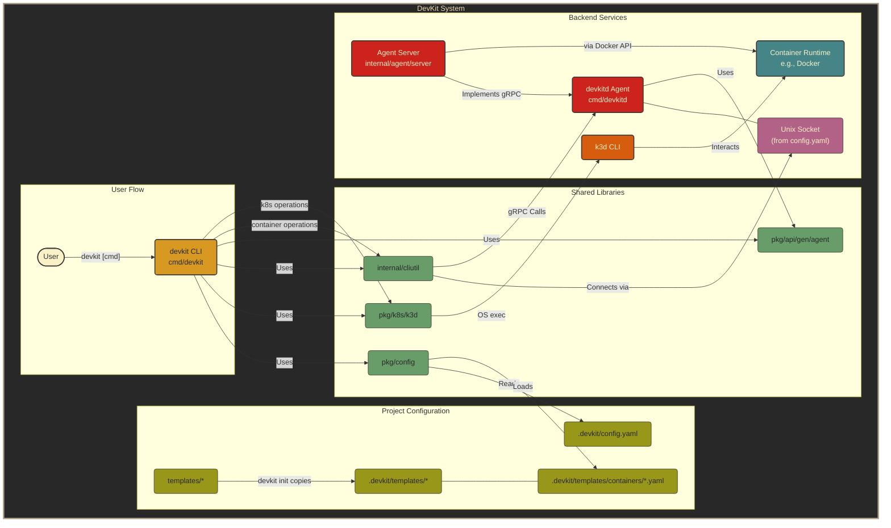

```mermaid
flowchart TD
    subgraph DevkitSystem["DevKit System"]
        %% Main components with optimized placement
        User([User])
        CLI["devkit CLI\ncmd/devkit"]

        %% Files and configuration
        ConfigFile[".devkit/config.yaml"]
        SourceTemplates["templates/*"]
        DevkitTemplates[".devkit/templates/*"]
        ContainerTemplates[".devkit/templates/containers/*.yaml"]

        %% Core components
        Agent["devkitd Agent\ncmd/devkitd"]
        AgentServer["Agent Server\ninternal/agent/server"]
        UnixSocket["Unix Socket\n(from config.yaml)"]
        Runtime["Container Runtime\ne.g., Docker"]
        K3D["k3d CLI"]

        %% Shared code packages with simplified connections
        PkgConfig["pkg/config"]
        PkgK3d["pkg/k8s/k3d"]
        InternalCliUtil["internal/cliutil"]
        PkgApi["pkg/api/gen/agent"]

        %% Logical groupings with clear hierarchy
        subgraph UserFlow["User Flow"]
            User --> |"devkit [cmd]"| CLI
        end

        subgraph ProjectFiles["Project Configuration"]
            SourceTemplates --> |"devkit init copies"| DevkitTemplates
            DevkitTemplates --- ContainerTemplates
            ConfigFile
        end

        subgraph CoreLibraries["Shared Libraries"]
            PkgConfig
            PkgK3d
            InternalCliUtil
            PkgApi
        end

        subgraph BackendServices["Backend Services"]
            AgentServer --> |"Implements gRPC"| Agent
            Agent --- UnixSocket
            Runtime
            K3D
        end

        %% Key relationship flows with reduced crossing lines
        CLI --> |"Uses"| PkgConfig & PkgK3d & InternalCliUtil & PkgApi

        %% Configuration relationships
        PkgConfig --> |"Reads"| ConfigFile
        PkgConfig --> |"Loads"| ContainerTemplates

        %% Communication paths optimized
        InternalCliUtil --> |"Connects via"| UnixSocket
        Agent --> |"Uses"| PkgApi
        AgentServer --> |"via Docker API"| Runtime
        PkgK3d --> |"OS exec"| K3D
        K3D --> |"Interacts"| Runtime

        %% Command flows grouped by functionality
        CLI --> |"container operations"| InternalCliUtil
        CLI --> |"k8s operations"| PkgK3d
        InternalCliUtil --> |"gRPC Calls"| Agent
    end

    %% Gruvbox Style Definitions with rounded edges
    classDef user fill:#fbf1c7,stroke:#3c3836,stroke-width:2px,rx:5,ry:5
    classDef cli fill:#d79921,stroke:#3c3836,stroke-width:2px,color:#282828,rx:5,ry:5
    classDef agent fill:#cc241d,stroke:#3c3836,stroke-width:2px,color:#fbf1c7,rx:5,ry:5
    classDef runtime fill:#458588,stroke:#3c3836,stroke-width:2px,color:#fbf1c7,rx:5,ry:5
    classDef file fill:#98971a,stroke:#3c3836,stroke-width:1px,color:#282828,rx:5,ry:5
    classDef pkg fill:#689d6a,stroke:#3c3836,stroke-width:1px,color:#282828,rx:5,ry:5
    classDef socket fill:#b16286,stroke:#3c3836,stroke-width:1px,color:#fbf1c7,rx:5,ry:5
    classDef k3d fill:#d65d0e,stroke:#3c3836,stroke-width:2px,color:#fbf1c7,rx:5,ry:5
    classDef container fill:#282828,stroke:#a89984,stroke-width:3px,color:#ebdbb2

    %% Apply classes
    class User user
    class CLI cli
    class Agent,AgentServer agent
    class K3D k3d
    class Runtime runtime
    class ConfigFile,ContainerTemplates,DevkitTemplates,SourceTemplates file
    class PkgConfig,PkgK3d,InternalCliUtil,PkgApi pkg
    class UnixSocket socket
    class DevkitSystem container
```
